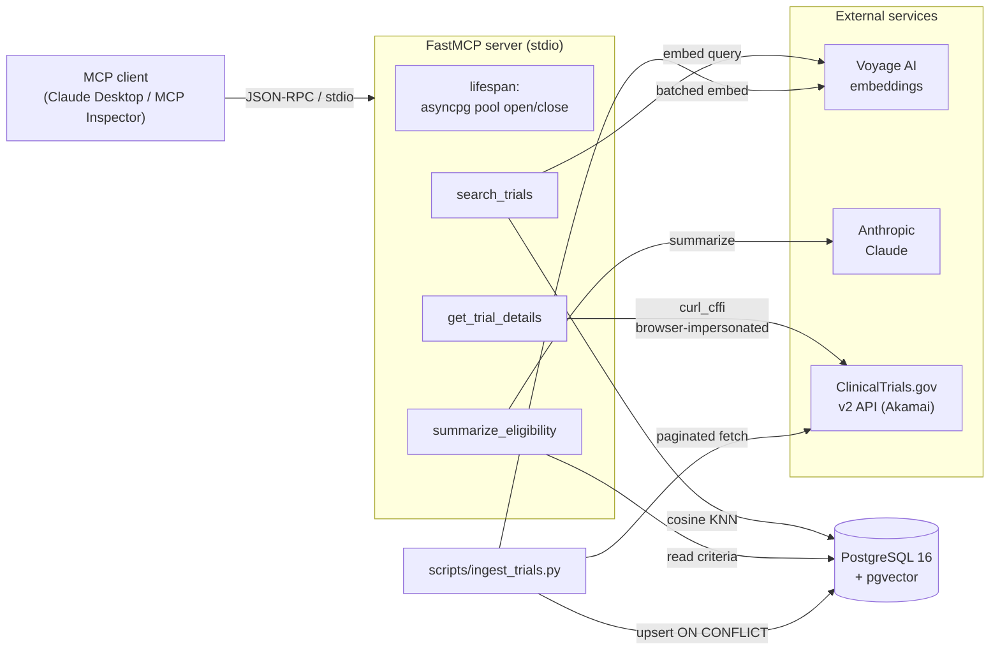

# 🧬 Clinical-Trial Search MCP Server

> Semantic search over ClinicalTrials.gov — as an MCP tool your AI assistant can actually use.

[](https://github.com/tjromack/clinical-mcp/actions/workflows/ci.yml)

**Status:** v0.1 — 4 tools working (hybrid search, similar-trials, live details, eligibility summary), 600+ trials ingested, validated end-to-end in Claude Desktop. 58 tests passing, `ruff` + `mypy` clean, CI green. See [TODO.md](TODO.md) for the roadmap.

📐 **[docs/PROJECT_QA.md](docs/PROJECT_QA.md)** — what it is / how it works / why, technical *and* plain-language, with interview pitches. **[docs/ENGINEERING_NOTES.md](docs/ENGINEERING_NOTES.md)** — the notable build moments (Akamai bot protection, TLS-intercepting proxy, the honest pgvector finding). Worth reading.

---

## What It Is

A Python [Model Context Protocol (MCP)](https://modelcontextprotocol.io/) server that gives Claude Desktop (or any MCP client) four tools over the ClinicalTrials.gov public dataset:

| Tool | What it does |
|---|---|
| `search_trials` | **Hybrid** search (pgvector cosine + Postgres full-text, fused via Reciprocal Rank Fusion) over 600+ trial summaries |
| `find_similar_trials` | "More like this" — vector KNN from an ingested trial's stored embedding |
| `get_trial_details` | Fetches live structured JSON for any trial by NCT ID |
| `summarize_eligibility` | Converts dense inclusion/exclusion criteria into plain English via Claude |

## Why It Exists

Clinical trial eligibility criteria are notoriously hard to parse — dense medical jargon, nested boolean logic, lab-value thresholds. Keyword search fails. This project:

- Demonstrates **pgvector semantic search** on real, NLP-hard data (not toy embeddings)
- Shows how to **author an MCP server** that Claude Desktop can invoke as native tools
- Provides a reference pattern transferable to legal documents, academic papers, or internal knowledge bases

---

## Tech Stack


---

## Demo


*Claude Desktop calling `search_trials` → `get_trial_details` → `summarize_eligibility` over the local pgvector dataset and the live ClinicalTrials.gov API.*

---

## Architecture



**Flow:** an MCP client drives the FastMCP server over stdio. `search_trials`
is local-only (Voyage embeds the query, pgvector ranks by cosine distance).
`get_trial_details` fetches live through the Akamai-safe `curl_cffi` client.
`summarize_eligibility` reads criteria from Postgres and has Claude rewrite
them. The ingest script populates pgvector ahead of time (one Voyage call per
batch). Tools never raise — every failure returns `TextContent`.

---

## Prerequisites

- Python 3.11+
- [uv](https://github.com/astral-sh/uv) (`curl -LsSf https://astral.sh/uv/install.sh | sh`)
- Docker + Docker Compose
- Anthropic API key (for the summarization tool)
- Voyage AI API key (for embeddings — [free tier](https://www.voyageai.com/) is generous)
- [Claude Desktop](https://claude.ai/download) (for end-to-end testing)

---

## Quick Start

### 1. Clone & install

```bash
git clone https://github.com/tjromack/clinical-mcp.git
cd clinical-mcp
uv sync
```

> **Behind a corporate/AV TLS-inspecting proxy?** Use `uv sync --native-tls`
> (or set `UV_NATIVE_TLS=1`). See [Troubleshooting](#troubleshooting).

### 2. Configure environment

```bash
cp .env.example .env
# Edit .env — add your ANTHROPIC_API_KEY and VOYAGE_API_KEY
```

### 3. Start Postgres with pgvector

```bash
docker compose up -d
```

### 4. Apply schema

Pipe the DDL into the container's `psql` (no local `psql` needed):

```bash
# bash / macOS / Linux
docker compose exec -T db psql -U ctmcp -d clinical_trials < src/clinical_trial_mcp/db/schema.sql
```

```powershell
# Windows PowerShell ( `<` redirection is unsupported there )
Get-Content src/clinical_trial_mcp/db/schema.sql | docker compose exec -T db psql -U ctmcp -d clinical_trials
```

### 5. Ingest trials

```bash
# ~500 trials matching 'cancer', embed summaries, store in pgvector
uv run python scripts/ingest_trials.py --query cancer --max 500

# --query is repeatable for a broader dataset (--max is per query):
uv run python scripts/ingest_trials.py --query cancer --query diabetes --max 300
```

### 6. Run the MCP server

```bash
uv run python -m clinical_trial_mcp.server
```

This is a **stdio** server: it starts, logs "server is up … waiting for an MCP
client", then sits idle until a client connects. That silence is expected —
drive it with Claude Desktop or the [MCP Inspector](https://github.com/modelcontextprotocol/inspector):

```bash
npx @modelcontextprotocol/inspector uv run python -m clinical_trial_mcp.server
```

### 7. Connect Claude Desktop

Copy [`claude_desktop_config.json.example`](claude_desktop_config.json.example)
into your Claude Desktop config and edit the absolute path:

- **Windows:** `%APPDATA%\Claude\claude_desktop_config.json`
- **macOS:** `~/Library/Application Support/Claude/claude_desktop_config.json`

```json
{
  "mcpServers": {
    "clinical-trials": {
      "command": "uv",
      "args": ["run", "--directory", "/ABSOLUTE/PATH/TO/clinical-mcp",
               "python", "-m", "clinical_trial_mcp.server"],
      "env": { "UV_NATIVE_TLS": "1" }
    }
  }
}
```

`--directory` makes `uv` use this project's venv and resolve its `.env`.
`UV_NATIVE_TLS=1` is needed if you're behind a TLS-inspecting proxy (harmless
otherwise). Postgres must be running and `.env` filled in. Restart Claude
Desktop — the four tools appear in the tool picker.

---

## Example Queries (in Claude Desktop)

- *"Find recruiting clinical trials for BRCA1 breast cancer mutations"*
- *"Get details for trial NCT04280705"*
- *"Summarize the eligibility criteria for that trial in plain English"*

---

## Running Tests

```bash
uv run pytest tests/ -v          # 61 tests, fully mocked (no DB/network/keys)
uv run ruff check . && uv run ruff format --check . && uv run mypy
```

---

## Running in Docker

There's a `Dockerfile` and an `mcp` Compose service for a reproducible
environment. **Honest scope:** this MCP server speaks **stdio** and is normally
spawned by Claude Desktop via `uv run` on the *host* — containerizing it does
**not** make Claude Desktop talk to a container. What the image buys you is a
pinned, reproducible env for running the **ingest script** and exercising the
server against the DB, plus a CI job that proves the image builds.

The `mcp` service is behind a `server` profile, so the normal dev flow
(`docker compose up -d`) still starts **only** Postgres — an idle stdio
container would just sit there. To use it:

```bash
docker compose --profile server build
# ingest inside the container (DB comes up automatically, healthcheck-gated):
docker compose run --rm mcp uv run python scripts/ingest_trials.py --query cancer --max 50
# sanity-check the server wiring (lists the 4 registered tools):
docker compose run --rm --no-deps mcp uv run python -c \
  "import asyncio; from clinical_trial_mcp.server import mcp; print([t.name for t in asyncio.run(mcp.list_tools())])"
```

(`.env` is picked up if present; the in-container `DATABASE_URL` is overridden
to the `db` service automatically.)

---

## Performance: is the pgvector index actually used?

The `embedding` column has an `ivfflat` cosine index (`trials_embedding_idx`).
`EXPLAIN ANALYZE` on the search query with the demo dataset (~20–500 rows):

```
Limit
  ->  Sort  (Sort Method: top-N heapsort)
        ->  Seq Scan on trials  (Filter: embedding IS NOT NULL)
Execution Time: ~0.6 ms
```

Postgres chooses a **sequential scan**, not the index — and that is *correct*:
on a tiny table a seq scan is genuinely faster than an ANN index walk. Forcing
`SET enable_seqscan = off` confirms the index is valid and gets used:

```
->  Index Scan using trials_embedding_idx on trials
```

So the index is in place and functional; the planner switches to it
automatically once the table is large enough (thousands+ of rows) for the ANN
path to win. This is the honest, expected behavior — not a misconfiguration.

---

## Troubleshooting

**`uv sync` fails with `invalid peer certificate: UnknownIssuer`** — you're
behind a TLS-intercepting proxy (corporate firewall / AV SSL scanning). Run
`uv sync --native-tls` or set `UV_NATIVE_TLS=1`. At runtime, Python's HTTP
calls use the OS trust store via `truststore` (auto-registered on import).

**`get_trial_details` / ingest gets `403 Forbidden` from ClinicalTrials.gov** —
the API is behind Akamai Bot Manager, which fingerprints standard HTTP clients.
This project uses `curl_cffi` with browser impersonation to get through; no
action needed. If a future Akamai change breaks it, pin a specific browser via
`CTGOV_IMPERSONATE` (e.g. `chrome124`) in `.env`.

**`curl: (60) SSL certificate problem` for CT.gov calls** — same proxy issue,
but `curl_cffi` uses libcurl's CA store (truststore can't patch it). Set
`CTGOV_SSL_VERIFY=false` in `.env`, or point `CTGOV_CA_BUNDLE` at your proxy's
root CA `.pem`.

**Voyage embeddings throttle after ~6 calls** — Voyage requires a payment
method on file even for free-tier usage. Add one in the Voyage dashboard.

---

## Project Structure

```
clinical-mcp/
├── src/clinical_trial_mcp/
│   ├── server.py            # FastMCP server + tool registration + lifespan
│   ├── __main__.py          # python -m clinical_trial_mcp
│   ├── ctgov.py             # shared curl_cffi ClinicalTrials.gov client
│   ├── tools/               # search_trials, get_trial_details, summarize_eligibility
│   ├── db/                  # asyncpg pool + schema.sql
│   ├── embeddings.py        # Voyage AI embedding wrapper + vector literal
│   └── config.py            # pydantic-settings
└── scripts/
    └── ingest_trials.py     # one-shot data population (repeatable --query)
```

---

## License

MIT — see [LICENSE](LICENSE)

---

*Data sourced from [ClinicalTrials.gov](https://clinicaltrials.gov/) — a resource of the U.S. National Library of Medicine.*
