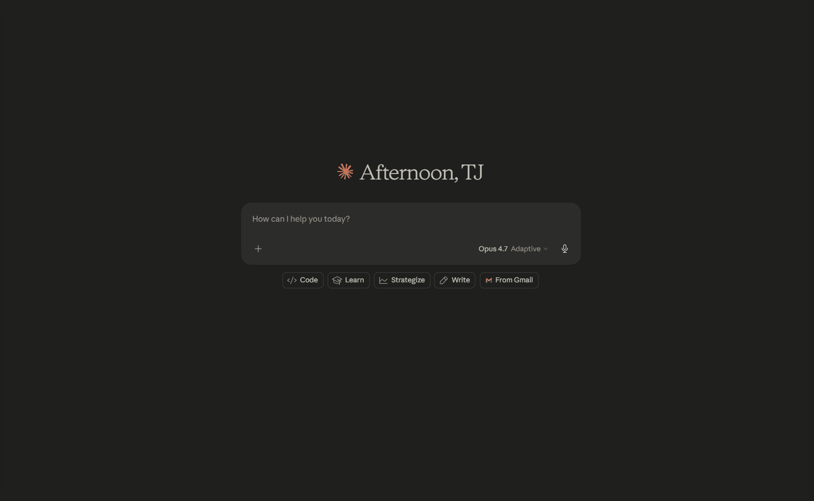
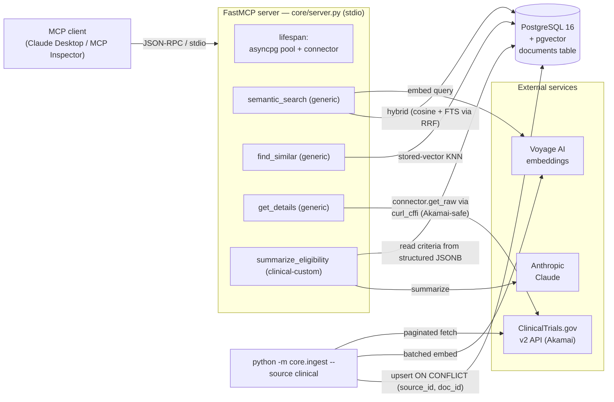

# 🧬 mcp-suite

> A suite of life-sciences MCP servers backed by curated, embedded, continuously-refreshed authoritative data — `ClinicalTrials.gov` today, with `openFDA`, `PubMed`, and more on the roadmap.

[](https://github.com/tjromack/mcp-suite/actions/workflows/ci.yml)

**Status:** the **clinical**, **openFDA** (4 sources), and **PubMed** servers are shipped on the shared `core/` + per-vertical `servers/<x>/` template. The suite now covers:
- **clinical** — ClinicalTrials.gov (3 generic tools + `summarize_eligibility` + `drug_context_for_trial` + `evidence_for_trial`)
- **openfda_label** — FDA drug labels (3 generic tools + `summarize_safety_profile` — synthesizes labels + FAERS + recalls for one drug)
- **openfda_event** — FAERS adverse-event reports (3 generic tools)
- **openfda_enforcement** — FDA drug recalls (3 generic tools)
- **openfda_drugsfda** — FDA Drugs@FDA approval history (3 generic tools)
- **pubmed** — PubMed biomedical literature (3 generic tools + `summarize_evidence` — cited synthesis over abstracts)

226 tests, `ruff` + `mypy` clean, CI green. Six `source_id`s span trials + the full FDA quadrant (labels · events · recalls · approvals) + literature, with an incremental refresh layer (`core.refresh`), per-tool-call metering + a `corpus_status` diagnostic, and an optional API-key/tier authorization gate (`mcp_platform/`). Adding the next vertical is ~one day's work — see the strategy docs at [`docs/mcp-suite/`](docs/mcp-suite/) and the live roadmap in [`TODO.md`](TODO.md).

📐 **[servers/clinical/PROJECT_QA.md](servers/clinical/PROJECT_QA.md)** — what the clinical server is / how it works / why, technical *and* plain-language, with interview pitches. **[docs/ENGINEERING_NOTES.md](docs/ENGINEERING_NOTES.md)** — the notable build moments (Akamai bot protection, TLS-intercepting proxy, the honest pgvector finding). Worth reading.

---

## What It Is

A Python [Model Context Protocol (MCP)](https://modelcontextprotocol.io/) **suite** of servers over curated, embedded, continuously-refreshed life-sciences data. Each server (one per source / vertical) implements a single `DataSource` Protocol and gets the generic tools for free; verticals add their own LLM-backed custom tools.

Each server exposes the same three **generic** tools (`semantic_search`, `find_similar`, `get_details`) over its own corpus — they're parameterized by `source_id` and come from `core/tools/` for free. Verticals add their own **custom** tools where the synthesis is unique:

| Server | Generic tools | Custom tools |
|---|---|---|
| **clinical** (ClinicalTrials.gov) | `semantic_search` · `find_similar` · `get_details` | `summarize_eligibility` — plain-English inclusion/exclusion at patient or clinician reading level<br>`drug_context_for_trial` — **cross-source SQL join**: extracts an NCT's interventions and surfaces their openFDA approval / label / FAERS / recall context<br>`evidence_for_trial` — **cross-source**: surfaces PubMed literature related to a trial's conditions + interventions |
| **openfda_label** (FDA SPL drug labels) | same | `summarize_safety_profile` — **cross-source**: queries labels + FAERS + recalls for one drug, single Voyage embedding, one Claude call, baked-in FDA disclaimer |
| **openfda_event** (FAERS adverse events) | same | — |
| **openfda_enforcement** (FDA drug recalls) | same | — |
| **openfda_drugsfda** (FDA Drugs@FDA approvals) | same | — (its approval data is surfaced via the clinical `drug_context_for_trial` join) |
| **pubmed** (PubMed literature) | same | `summarize_evidence` — cited synthesis over the local abstract corpus; every claim cites a retrieved PMID, not-medical-advice disclaimer |

The cross-source tools (`drug_context_for_trial`, `summarize_safety_profile`, `evidence_for_trial`) are the "cross-sell" tools that exist only because the suite exists — see [`docs/mcp-suite/02-openfda-server-plan.md`](docs/mcp-suite/02-openfda-server-plan.md) §3 and [`04-pubmed-server-plan.md`](docs/mcp-suite/04-pubmed-server-plan.md) §3.

> **Heads-up for upgraders:** the clinical tool names changed in the Phase-A refactor. Old names (`search_trials`, `find_similar_trials`, `get_trial_details`) → new generic names (`semantic_search`, `find_similar`, `get_details`). `summarize_eligibility` is unchanged.

## Why It Exists

Clinical trial eligibility criteria are notoriously hard to parse — dense medical jargon, nested boolean logic, lab-value thresholds. Keyword search fails. This project:

- Demonstrates **pgvector semantic search** on real, NLP-hard data (not toy embeddings)
- Shows how to **author an MCP server** that Claude Desktop can invoke as native tools
- Provides a reference pattern transferable to legal documents, academic papers, or internal knowledge bases

---

## Tech Stack


---

## Demo



*Claude Desktop calling `semantic_search` → `get_details` → `summarize_eligibility` over the local pgvector dataset and the live ClinicalTrials.gov API. (Recorded pre-refactor under the old tool names — behaviour is identical.)*

---

## Architecture



**Flow:** an MCP client drives the FastMCP server over stdio. `semantic_search`
is local-only (Voyage embeds the query, pgvector ranks via RRF over cosine + FTS).
`get_details` fetches live through the Akamai-safe `curl_cffi` client wrapped
inside the clinical connector. `summarize_eligibility` reads from the local
`documents` table and has Claude rewrite the criteria. The generic ingest
runner populates pgvector ahead of time (one Voyage call per
batch). Tools never raise — every failure returns `TextContent`.

---

## Prerequisites

- Python 3.11+
- [uv](https://github.com/astral-sh/uv) (`curl -LsSf https://astral.sh/uv/install.sh | sh`)
- Docker + Docker Compose
- Anthropic API key (for the summarization tool)
- Voyage AI API key (for embeddings — [free tier](https://www.voyageai.com/) is generous)
- [Claude Desktop](https://claude.ai/download) (for end-to-end testing)

---

## Quick Start

### 1. Clone & install

```bash
git clone https://github.com/tjromack/mcp-suite.git
cd mcp-suite
uv sync
```

> **Behind a corporate/AV TLS-inspecting proxy?** `uv` bundles its own CA
> store, so *every* `uv` command (`uv sync` **and** `uv run …`) fails with
> `invalid peer certificate: UnknownIssuer`. Set `UV_NATIVE_TLS=1` once for
> the session (PowerShell: `$env:UV_NATIVE_TLS = "1"`) — it covers all `uv`
> commands and is a harmless no-op off-proxy. See [Troubleshooting](#troubleshooting).

### 2. Configure environment

```bash
cp .env.example .env
# Edit .env — add your ANTHROPIC_API_KEY and VOYAGE_API_KEY
```

### 3. Start Postgres with pgvector

```bash
docker compose up -d
```

### 4. Apply schema

Pipe the DDL into the container's `psql` (no local `psql` needed):

```bash
# bash / macOS / Linux
docker compose exec -T db psql -U ctmcp -d clinical_trials < core/store/schema.sql
```

```powershell
# Windows PowerShell ( `<` redirection is unsupported there )
Get-Content core/store/schema.sql | docker compose exec -T db psql -U ctmcp -d clinical_trials
```

### 5. Ingest a corpus

The generic runner discovers each server from its `server.toml` (the clinical server's queries live in [`servers/clinical/server.toml`](servers/clinical/server.toml) under the `[connector]` table):

```bash
uv run python -m core.ingest --source clinical
# optional incremental refresh (advisory):
uv run python -m core.ingest --source clinical --since 2026-01-01
```

`scripts/ingest_trials.py` is now a thin compat shim that delegates to the generic runner with `--source clinical` — old muscle-memory commands keep working.

For the openFDA family, ingest each source the same way (cap with `max_records` in the relevant `server.toml` for a sanity run):

```bash
uv run python -m core.ingest --source openfda_label
uv run python -m core.ingest --source openfda_event
uv run python -m core.ingest --source openfda_enforcement
uv run python -m core.ingest --source openfda_drugsfda
# PubMed — scope the corpus via the `term` in servers/pubmed/server.toml:
uv run python -m core.ingest --source pubmed
```

The connector reads `OPENFDA_API_KEY` from `.env` (optional — anonymous allows 1k requests/day per IP; a free key lifts that to 120k/day). All four openFDA sources write to the same `documents` table under different `source_id`s, so `summarize_safety_profile` (on the openfda_label server) can join across them in one query.

### 5b. Keep it fresh — incremental refresh (Phase F)

`core.refresh` is the orchestrator that makes the "continuously refreshed" claim real. It tracks a per-source watermark in the `source_state` table and runs each connector's incremental `fetch(since)` — advancing the watermark only on success, so a failed run retries its window rather than skipping data.

```bash
uv run python -m core.refresh --source pubmed   # one source, incremental
uv run python -m core.refresh --all             # every source, incremental
uv run python -m core.refresh --due             # only sources past their cadence (scheduler mode)
uv run python -m core.refresh --full --source openfda_event   # ignore watermark, full re-backfill
```

Each `servers/<id>/server.toml` declares a `[refresh] cadence` (`daily` for FAERS, `weekly` for the rest); `--due` honors it. [`.github/workflows/refresh.yml`](.github/workflows/refresh.yml) is an example cron scheduler that runs `--due` daily against a hosted DB. Check staleness any time with `SELECT source_id, last_success_at, last_status, last_doc_count FROM source_state;`.

### 5c. Observability — metering + `corpus_status` (Phase G)

Every tool call (generic and custom, on every server) is metered: one row in the `tool_calls` table with the source, tool, latency, response size, and outcome. Metering is best-effort — a failed insert is logged and swallowed, never breaking a tool response. This is the usage substrate the pricing model needs ("you can't price what you don't measure").

Every server also exposes a `corpus_status` tool — a whole-suite health view: per-source document counts, freshness (newest record + last-refresh age + status from `source_state`), and a 7-day tool-usage summary from the meter. Call it from any MCP client, or query directly:

```sql
SELECT tool_name, count(*), avg(duration_ms)::int AS avg_ms
FROM tool_calls WHERE created_at > now() - interval '7 days'
GROUP BY tool_name ORDER BY 2 DESC;
```

### 5d. Authorization — API keys + tiers (Phase H)

An optional in-process authorization gate ([`mcp_platform/`](mcp_platform/)). Off by default (`AUTH_ENABLED=false`) so local/stdio dev is ungated. When on, every tool call is checked against the key in `MCP_SUITE_API_KEY`: tier monthly-call cap + cross-server-tool gating, reading the Phase-G meter as the usage ledger. Keys are stored as a sha256 hash only (raw key shown once).

| Tier | Monthly calls | Cross-server tools |
|---|---|---|
| free | 50 | ✗ |
| pro | 2,500 | ✗ |
| suite | 15,000 | ✓ (`drug_context_for_trial`, `evidence_for_trial`, `summarize_safety_profile`) |
| enterprise | unlimited | ✓ |

```bash
uv run python -m mcp_platform.keys issue --tier suite --label "alice@acme"   # prints the key once
uv run python -m mcp_platform.keys list
# Run a server with gating on:
AUTH_ENABLED=true MCP_SUITE_API_KEY=mcps_... MCP_SUITE_SOURCE=clinical uv run python -m core.server
```

Denied calls return a clean `Access denied: …` message (never an exception) and are recorded with status `denied`. `corpus_status` is exempt (never gated). The same `authorize()` gate would sit behind an HTTP gateway later — see [`mcp_platform/README.md`](mcp_platform/README.md).

### 6. Run the MCP server

```bash
uv run python -m clinical_trial_mcp.server
```

This is a **stdio** server: it starts, logs "server is up … waiting for an MCP
client", then sits idle until a client connects. That silence is expected —
drive it with Claude Desktop or the [MCP Inspector](https://github.com/modelcontextprotocol/inspector):

```bash
npx @modelcontextprotocol/inspector uv run python -m clinical_trial_mcp.server
```

### 7. Connect Claude Desktop

Copy [`claude_desktop_config.json.example`](claude_desktop_config.json.example)
into your Claude Desktop config and edit the absolute path:

- **Windows:** `%APPDATA%\Claude\claude_desktop_config.json`
- **macOS:** `~/Library/Application Support/Claude/claude_desktop_config.json`

```json
{
  "mcpServers": {
    "clinical-trials": {
      "command": "uv",
      "args": ["run", "--directory", "/ABSOLUTE/PATH/TO/mcp-suite",
               "python", "-m", "core.server"],
      "env": { "UV_NATIVE_TLS": "1", "MCP_SUITE_SOURCE": "clinical" }
    },
    "fda-drugs": {
      "command": "uv",
      "args": ["run", "--directory", "/ABSOLUTE/PATH/TO/mcp-suite",
               "python", "-m", "core.server"],
      "env": { "UV_NATIVE_TLS": "1", "MCP_SUITE_SOURCE": "openfda_label" }
    },
    "pubmed": {
      "command": "uv",
      "args": ["run", "--directory", "/ABSOLUTE/PATH/TO/mcp-suite",
               "python", "-m", "core.server"],
      "env": { "UV_NATIVE_TLS": "1", "MCP_SUITE_SOURCE": "pubmed" }
    }
  }
}
```

One MCP-server entry per `source_id` — `core.server` reads `MCP_SUITE_SOURCE` (default `clinical`) to pick which `servers/<id>/server.toml` to wire. Add more entries for `openfda_event` / `openfda_enforcement` / `openfda_drugsfda` if you want their generic tools too; the cross-source `summarize_safety_profile` lives on the `openfda_label` entry and queries the openFDA corpora in one go. The `pubmed` entry adds literature search + the cited `summarize_evidence` synthesizer; the clinical entry's `drug_context_for_trial` joins a trial's drugs to their FDA approval/label/FAERS/recall context, and `evidence_for_trial` joins to related PubMed literature.

`--directory` makes `uv` use this project's venv and resolve its `.env`. `UV_NATIVE_TLS=1` is harmless off-proxy. Postgres must be running and `.env` filled in. Restart Claude Desktop fully (system tray quit) for new config to load.

The legacy `python -m clinical_trial_mcp.server` entry point still works as a compat shim — it's equivalent to `core.server` with `MCP_SUITE_SOURCE=clinical`.

---

## Example Queries (in Claude Desktop)

- *"Find recruiting clinical trials for BRCA1 breast cancer mutations"*
- *"Get details for trial NCT04280705"*
- *"Summarize the eligibility criteria for that trial in plain English"*

---

## Running Tests

```bash
uv run pytest tests/ -v          # 226 tests, fully mocked (no DB/network/keys)
uv run ruff check . && uv run ruff format --check . && uv run mypy
```

---

## Running in Docker

There's a `Dockerfile` and an `mcp` Compose service for a reproducible
environment. **Honest scope:** this MCP server speaks **stdio** and is normally
spawned by Claude Desktop via `uv run` on the *host* — containerizing it does
**not** make Claude Desktop talk to a container. What the image buys you is a
pinned, reproducible env for running the **ingest script** and exercising the
server against the DB, plus a CI job that proves the image builds.

The `mcp` service is behind a `server` profile, so the normal dev flow
(`docker compose up -d`) still starts **only** Postgres — an idle stdio
container would just sit there. To use it:

```bash
docker compose --profile server build
# ingest inside the container (DB comes up automatically, healthcheck-gated):
docker compose run --rm mcp uv run python -m core.ingest --source clinical
# sanity-check the server wiring (lists the registered tools):
docker compose run --rm --no-deps -e MCP_SUITE_SOURCE=clinical mcp uv run python -c \
  "import asyncio; from core.server import mcp; print([t.name for t in asyncio.run(mcp.list_tools())])"
```

(`.env` is picked up if present; the in-container `DATABASE_URL` is overridden
to the `db` service automatically.)

---

## Performance: is the pgvector index actually used?

The `embedding` column has an `ivfflat` cosine index (`trials_embedding_idx`).
`EXPLAIN ANALYZE` on the search query with the demo dataset (~20–500 rows):

```
Limit
  ->  Sort  (Sort Method: top-N heapsort)
        ->  Seq Scan on trials  (Filter: embedding IS NOT NULL)
Execution Time: ~0.6 ms
```

Postgres chooses a **sequential scan**, not the index — and that is *correct*:
on a tiny table a seq scan is genuinely faster than an ANN index walk. Forcing
`SET enable_seqscan = off` confirms the index is valid and gets used:

```
->  Index Scan using trials_embedding_idx on trials
```

So the index is in place and functional; the planner switches to it
automatically once the table is large enough (thousands+ of rows) for the ANN
path to win. This is the honest, expected behavior — not a misconfiguration.

---

## Troubleshooting

**`uv sync` fails with `invalid peer certificate: UnknownIssuer`** — you're
behind a TLS-intercepting proxy (corporate firewall / AV SSL scanning). Run
`uv sync --native-tls` or set `UV_NATIVE_TLS=1`. At runtime, Python's HTTP
calls use the OS trust store via `truststore` (auto-registered on import).

**`get_details` / ingest gets `403 Forbidden` from ClinicalTrials.gov** —
the API is behind Akamai Bot Manager, which fingerprints standard HTTP clients.
This project uses `curl_cffi` with browser impersonation to get through; no
action needed. If a future Akamai change breaks it, pin a specific browser via
`CTGOV_IMPERSONATE` (e.g. `chrome124`) in `.env`.

**`curl: (60) SSL certificate problem` for CT.gov calls** — same proxy issue,
but `curl_cffi` uses libcurl's CA store (truststore can't patch it). Set
`CTGOV_SSL_VERIFY=false` in `.env`, or point `CTGOV_CA_BUNDLE` at your proxy's
root CA `.pem`.

**Voyage embeddings throttle after ~6 calls** — Voyage requires a payment
method on file even for free-tier usage. Add one in the Voyage dashboard.

---

## Project Structure

```
mcp-suite/
├── core/                              # shared, vertical-agnostic substrate
│   ├── document.py                    # canonical Document Pydantic model (doc 01 §4)
│   ├── connector.py                   # DataSource Protocol (doc 01 §3)
│   ├── store/{connection,schema.sql}  # asyncpg pool + generic `documents` table (doc 01 §5)
│   ├── embeddings.py                  # Voyage wrapper (embed_text + embed_texts batched)
│   ├── cache.py                       # process-local TTL cache primitive
│   ├── config.py                      # pydantic-settings base config
│   ├── tools/                         # generic semantic_search / get_details / find_similar
│   ├── ingest.py                      # generic CLI: python -m core.ingest --source <id>
│   └── server.py                      # FastMCP entry point — reads server.toml, registers tools
│
├── servers/                           # one subdir per source_id
│   ├── clinical/                      # ClinicalTrials.gov
│   │   ├── connector.py               # CTGovConnector(DataSource) wrapping ctgov.py
│   │   ├── ctgov.py                   # Akamai-safe curl_cffi client (with retry+backoff)
│   │   ├── tools.py                   # summarize_eligibility (clinical-specific LLM tool)
│   │   └── server.toml                # source_id, embed_fields, generic + custom tool roster
│   ├── openfda_shared/                # shared scaffolding for the 3 openFDA connectors
│   │   └── _base.py                   # OpenFDAConnectorBase + httpx client + DISCLAIMER
│   ├── openfda_label/                 # FDA SPL drug labels
│   │   ├── connector.py               # OpenFDALabelConnector(DataSource)
│   │   ├── tools.py                   # summarize_safety_profile (CROSS-SOURCE custom tool)
│   │   └── server.toml
│   ├── openfda_event/                 # FAERS adverse-event reports (generic tools only)
│   │   ├── connector.py               # OpenFDAEventConnector(DataSource)
│   │   └── server.toml
│   ├── openfda_enforcement/           # FDA drug recalls (generic tools only)
│   │   ├── connector.py               # OpenFDAEnforcementConnector(DataSource)
│   │   └── server.toml
│   ├── openfda_drugsfda/              # FDA Drugs@FDA approval history (generic tools only)
│   │   ├── connector.py               # OpenFDADrugsFDAConnector(OpenFDAConnectorBase)
│   │   └── server.toml
│   └── pubmed/                        # PubMed biomedical literature (NCBI E-utilities)
│       ├── connector.py               # PubMedConnector(DataSource) — esearch→efetch, stdlib XML
│       ├── tools.py                   # summarize_evidence (cited literature synthesizer)
│       └── server.toml
│
├── src/clinical_trial_mcp/            # Phase-A compat shims for old entry-point commands
├── scripts/ingest_trials.py           # compat shim → core.ingest --source clinical
├── docs/mcp-suite/                    # the strategy docs (canonical copy lives in dev-dashboard)
└── mcp_platform/                      # placeholder: future gateway/billing/deploy layer
```

---

## License

MIT — see [LICENSE](LICENSE)

---

*Data sourced from [ClinicalTrials.gov](https://clinicaltrials.gov/) — a resource of the U.S. National Library of Medicine.*
