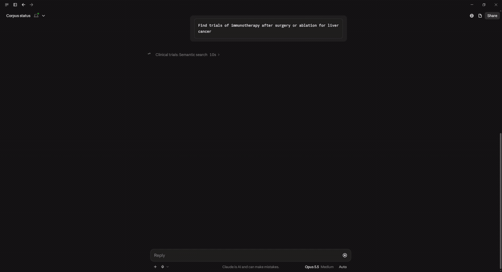
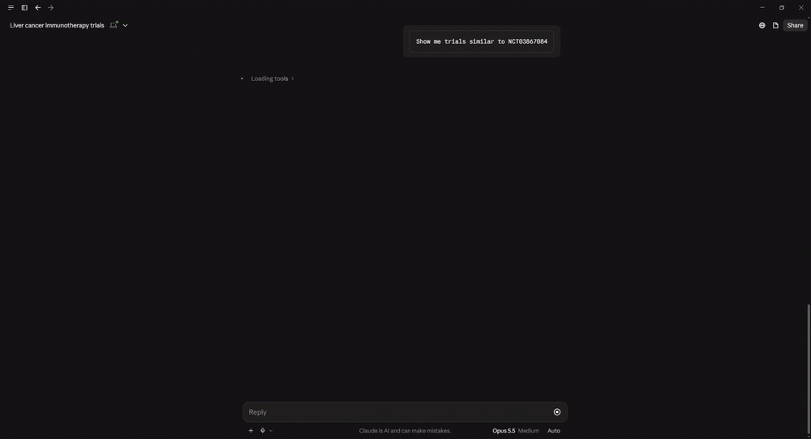

# core/ — shared substrate

Generic, vertical-agnostic modules used by every server in the suite. Nothing
in this directory knows about ClinicalTrials.gov, openFDA, or any specific
data source — those live under `servers/<vertical>/`.

| Submodule | Purpose |
|---|---|
| `core/document.py` | The `Document` Pydantic model — the unit every connector emits and the generic tools query |
| `core/connector.py` | The `DataSource` Protocol — `source_id`, `embed_fields`, `fetch`, `normalize`, `get_raw` |
| `core/store/` | asyncpg pool + the generic `documents` table schema (partitioned by `source_id`) |
| `core/embeddings.py` | Voyage embedding wrapper (single + batched), shared by every server |
| `core/cache.py` | Process-local TTL cache primitive |
| `core/config.py` | `pydantic-settings` base config; each server extends it |
| `core/tools/` | The generic MCP tools (`semantic_search`, `get_details`, `find_similar`), parameterized by `source_id` |
| `core/ingest.py` | The single CLI: `python -m core.ingest --source <id> [--since YYYY-MM-DD]` |
| `core/server.py` | The MCP server entry point — reads a `server.toml`, registers the generic + custom tools, runs over stdio |

Populated incrementally during the Phase A refactor; see the plan in
`elegant-chasing-glade.md` (root of this branch).

## The generic tools in action

Every vertical gets these three for free. Hybrid search (pgvector + full-text, fused with RRF) over the clinical corpus:

Nearest neighbours from one document's stored embedding:

