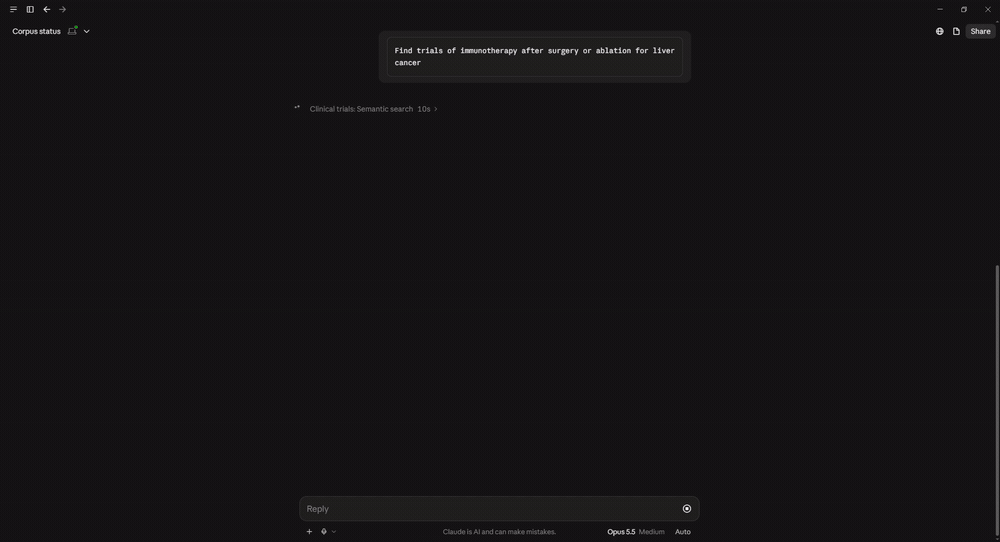
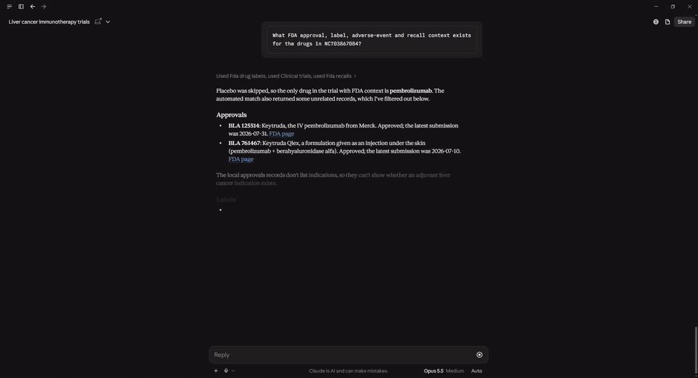
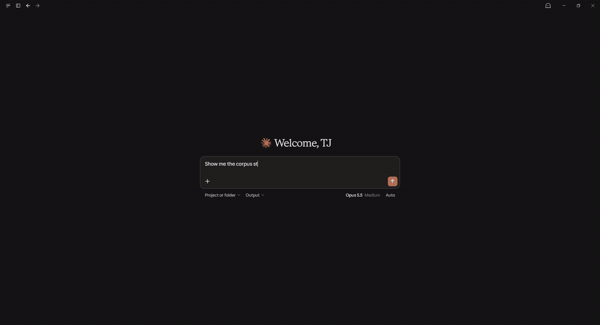

# mcp-suite — clinical trials, FDA data and literature as tools an assistant can call

Draft for the `/work` tab, following the case-study template. Image paths are repo-relative here;
on the site they become `/media/<file>` once `docs/media/` is copied into `public/media/`.

---

## The situation

Someone evaluating a cancer treatment works across three public sources: the trial registry for
what is being studied, FDA data for what is approved and what has gone wrong with it, and the
published literature for what has been reported. All three are free and public. Using them together
is still slow, because each has its own query syntax and record shape, and nothing links a trial to
the drug's label or to the papers about it.

The work is not access. It is retrieval, normalisation, and the joins between sources.

## Constraints

- **Public and synthetic sources only.** No patient data enters the system, by construction, and the
  README says so.
- **Regulated content carries obligations.** FDA and PubMed responses need a disclaimer that a model
  cannot choose to omit, so the disclaimer is appended in code.
- **Upstream is not under my control.** ClinicalTrials.gov sits behind Akamai bot protection that
  403s ordinary HTTP clients on TLS fingerprint. openFDA allows 1,000 requests a day anonymously.
  NCBI allows three a second. All three need backoff, caching and incremental fetch.
- **The client is Claude Desktop**, which speaks MCP over stdio. One process serves one source.
- **Retrieval has to be inspectable.** A tool that returns documents is only useful if someone can
  check whether they are the right ones.

## The design

One canonical `documents` table holds every source, keyed by `source_id`, with the vector, the
full-text index and a per-source `structured` JSON payload in the same row. A `DataSource` protocol
defines what a vertical must implement: `fetch`, `normalize`, `get_raw`. Implement it and the three
generic tools — `semantic_search`, `find_similar`, `get_details` — come for free, declared in a
`server.toml`. Verticals add custom tools only where the synthesis is specific to that source.

Search is hybrid: pgvector cosine and Postgres full-text, fused with Reciprocal Rank Fusion. Vector
alone misses exact identifiers; full-text alone misses paraphrase.



The payoff of one shared table is the cross-source tools. `drug_context_for_trial` takes a trial's
interventions and joins them against FDA approvals, labels, adverse-event reports and recalls — as
SQL, with no model in the path, so the same question returns the same answer. Placebo and other
non-drug comparators are skipped and reported as skipped.



**The alternative I rejected:** a database per source, with the assistant fanning out across servers
and stitching results. It would have been simpler to start and would have made every cross-source
question an application-level join over three network calls — slower, non-deterministic, and
impossible to express as one SQL statement. The shared table costs a canonical schema that every
connector must map into. That mapping is the work, and it is where the value is.

Six servers, nine tools, 212,919 documents locally. A 300-document slice ships in the repo so a
clone is queryable from `docker compose up -d` with no API keys.

**The second table is the one that answers different questions.** One embedded row per citable
record is the right shape for retrieval and the wrong shape for analysis: there is no grain, nothing
joins, and "how many distinct adverse-event cases, as opposed to reports?" has no SQL to express it.
So a relational staging layer sits beside the document store — the same upstreams' *relational*
files loaded as real tables. Four quarterly FAERS extracts, all seven tables plus the FDA's
withdrawn-case list; five tables from a pinned monthly AACT archive of ClinicalTrials.gov. 29.5M
rows, every table with a declared grain and a gate that proves it.

Three rules hold throughout, and each is a check rather than an intention. Partition first, so
re-loading a quarter replaces that quarter and nothing else. Nothing dropped: a line that will not
parse is kept verbatim with its line number, and `rows_read = rows_loaded + rows_rejected` is
re-checked from the database. Nothing guessed: a FAERS date that gives only a month keeps its raw
value and its precision, and gets a real `DATE` only where the upstream gave a day — padding it
would invent values nothing downstream could tell from observed ones.

AACT publishes its archive as one 2.5 GB zip and this layer needs five of its 49 members. A zip's
directory lives at the end of the file and each member is an addressable byte range, so the loader
reads the central directory over HTTP range requests and fetches only those five: 332 MB instead of
2,534 MB, an eighth of the transfer, with no separate code path for local archives.

## How it's verified

| Check | Result |
|---|---|
| Contract and unit tests | 433 passing, 182 of them contract or failure-path — 429 with `Retry-After`, 5xx, timeouts, malformed bodies, unreachable database, empty corpus |
| Retrieval spot-check, 20 labelled questions | hit@1 70%, hit@3 80%, hit@10 95%, MRR 0.77 — misses published |
| Clean-clone CI | Every push: `docker compose up`, six servers selftest, a keyless search returns real trials |
| End-to-end tour | All nine tools over real MCP stdio, 14/14 steps |
| Staging gates | Grain, conservation, dedup, integrity, rejects over 29.5M rows — 5/5 pass, every number published |
| Staging integration tests | Loader, gates and report against a real Postgres rather than a fake — 8 tests, run in the clean-clone CI job |

Per-tool contract tests drive `list_tools()` for all six servers and assert the registered names, input-schema arguments, read-only annotations and the `list[TextContent]` return — the surface a client actually sees.

The retrieval score is scored against the full corpus, not the demo slice, and the report names
every miss with what outranked it. `corpus_status` reports each source's size and refresh age, so
staleness is visible rather than assumed:



## What broke

**Every cross-source tool crashed on every call, and the test suite was green.** The asyncpg pool
had no JSON codec, so `structured` came back as a string and `.get()` failed. The unit tests built
their fixtures as dicts, which is what the code expected, so they passed. It surfaced the first time
the servers ran end to end against a real database. The fix is one codec registration; the lesson is
that a fully mocked suite tests the code's assumptions rather than the system.

Three more, found the same way:

- **Incremental refresh was broken for all four openFDA sources.** The date filter was built as
  `[20260530+TO+99991231]`; httpx percent-encodes `+`, and openFDA answers HTTP 500. Spaces work.
  Verified against all four live endpoints, with a regression test asserting no `%2B` reaches the
  wire.
- **The safety-profile tool used knowledge it had not been given.** Its prompt carried label
  metadata but no label text, so under "headline risks" the model wrote what pembrolizumab labelling
  "typically" says and asserted a boxed warning the record does not have. It also presented recalls
  that matched by similarity but named a different drug. It now receives label excerpts anchored on
  the SPL warning sections and each recall's product description, and must drop records that do not
  name the drug.
- **A stopped database killed the server at startup**, which Claude Desktop reports as
  "Connection closed" — pointing at the client rather than at Postgres. It now starts anyway, tells
  the caller what to run, and reconnects on a later call without a restart.

**And once more on the staging layer, where I blamed the wrong component first.** The first real
load ran at 450 rows per second — 438,512 rows took sixteen minutes — and Postgres was the obvious
suspect: 36 columns, two indexes, a container on a Windows host. Measuring instead of assuming took
ten minutes and said otherwise. `COPY` into the same shape did 390,000 rows per second. The parser
did 118,000 rows per second. The download took twelve seconds. None of them was the problem.

The problem was one line of mine. The line reader accumulated each decompressed chunk in a buffer
and consumed it with `pending = pending[index + 1:]`, which copies everything left in the buffer
once per line. An 8 MiB compressed chunk inflates to about 40 MB and holds roughly 300,000 lines, so
that slice moved terabytes to read a file. Splitting once per chunk instead of slicing once per line
made the same load take 21 seconds — 47× faster, and the four-quarter load went from an overnight
job to about eight minutes. The regression test asserts 200,000 lines parse in under ten seconds,
which the quadratic version missed by minutes.

Two findings came out of the gates rather than out of a bug, and both change how the data must be
used:

- **FAERS child tables have no unique key.** I declared `(primaryid, drug_seq)` as the grain of the
  drug table because that is what the documentation implies. Across 7,294,235 drug rows the gate
  found only 6,569,196 distinct keys, with one key accounting for 103 rows — the same drug, the same
  route, differing only in the reported manufacturing lot. `(primaryid, drug_seq)` is how you *join*
  a drug to its therapy dates and indications; it is not what identifies a row. Counting rows after
  that join counts lot reports, not drugs. The declaration now says so, and the gate publishes the
  fan-out — 1.11× overall, 103× at worst — instead of asserting a uniqueness that was never there.
- **Every orphaned AACT child traces to a rejected parent.** The integrity gate reported 857 child
  rows pointing at studies that are not in the snapshot, which looked like upstream inconsistency.
  It is not: 62 study rows were rejected at load because an unescaped `|` inside an official title
  widened them, and those are exactly the 62 studies whose sponsors, conditions, interventions and
  sites are orphaned. The gate now reconciles orphans against the reject lane by key and fails only
  on the ones the reject lane cannot explain.

## What this doesn't prove

- Not clinical decision support: no clinical validation, no regulatory clearance, not for diagnosis,
  treatment selection or enrolment decisions.
- The corpus is a scoped subset — cancer-focused trials, sampled FDA data, one PubMed topic. A
  record absent here may exist upstream.
- Retrieval is scored on 20 questions written by the person who built the corpus. The interval
  around those percentages is wide.
- Single Postgres, stdio transport, one tenant. The API-key tier gate exists and is off by default.
- The staging layer is pinned, not live: four FAERS quarters and one AACT monthly archive, loaded
  on demand. It is not a pharmacovigilance pipeline, it computes no disproportionality
  statistic, and FAERS counts are not incidence rates — the reports are voluntary, unverified
  and duplicated across reporters.
- The staging gates prove keys, conservation and referential integrity. They say nothing about
  whether a value is clinically plausible.

## What I'd do differently

Embed the `interventions` field from the start. Trials registered under a development code —
DS-8201a rather than trastuzumab deruxtecan — rank 28th for a question using the generic name, while
a sibling trial ranks first. The synonyms were in the structured payload the whole time.

And write the end-to-end smoke test before the unit tests, not after. Every defect above was found
by running the thing, and each one had passing unit tests over it. The staging layer now has eight
tests that need a real Postgres and skip without one; the first bug they would have caught — asyncpg
inferring a bound parameter's type from its cast, so a string partition key raised rather than
loading — is one no fake connection can model.

I would also profile before optimising, and before blaming. The 47× loss was mine, not the
database's, and ten minutes of measurement found it after an hour of plausible theories about
Docker volumes and index maintenance.

---

## For the website

Copy `docs/media/*.gif` and `docs/media/*.mp4` into the site's `public/media/`.

The GIFs autoplay and need no JavaScript; use them for the three placements above:

```html

```

The MP4s are a quarter the size and show the full flow including the question being asked. Prefer
them where a little JavaScript is acceptable:

```html
<video src="/media/05-cross-source.mp4" poster="/media/05-cross-source.jpg" autoplay muted loop playsinline preload="metadata" width="1280" style="max-width:100%;border-radius:8px;"></video>
```

Project card:

```ts
tryIt: { label: "Watch it run", href: "/work/mcp-suite#demo", kind: "demo" }
verifiedBy: ["hit@3 80% on 20 labelled questions", "clean-clone CI", "309 tests"]
```
