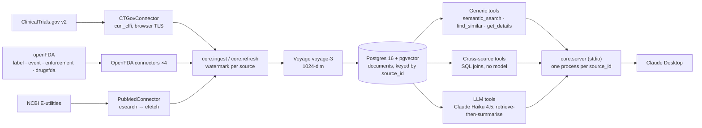

# mcp-suite → tjromack.com — case-study source packet

Everything needed to write `src/content/projects/mcp-suite.mdx` without re-deriving anything.
Validated against the site's `src/content.config.ts` schema and `_template.mdx` section order as of
2026-09-22. Every number below is reproducible; §5 gives the command for each.

---

## 1. Frontmatter — paste-ready

```yaml
---
title: mcp-suite
summary: Six MCP servers that put clinical trials, FDA drug data and PubMed
  literature inside Claude as callable tools, with retrieval scored against a
  labelled set rather than eyeballed.
date: 2026-09-22
tech:
  - python
  - postgresql
  - pgvector
  - mcp
  - anthropic-api
  - docker
lenses:
  - applied-ai
  - data-engineering
demonstrates: Cross-source joins over one canonical table, with retrieval
  scored and its misses published.
featured: false
order: 10
draft: true
repo: "https://github.com/tjromack/mcp-suite"
---
```

Schema notes: `summary` ≤ 180 chars (this is 178 — close to the cap, so edit carefully), `demonstrates` 20–120 (this is 92), `tech` max 6,
`lenses` max 3 with the first as primary. No `demo:` — there is no hosted instance, and the schema
would rather have the field absent than a 404. If you set `cover:`, `coverAlt:` becomes required;
`docs/media/05-cross-source.jpg` is the strongest single still.

---

## 2. Section source material

Written to the site template's sections. Prose is raw material, not final copy.

### Summary

Six MCP servers expose ClinicalTrials.gov, four FDA datasets and PubMed to Claude as callable tools
over one Postgres table. The non-obvious part is the shared schema: because every source normalises
into the same `documents` row, a question like "what FDA context exists for this trial's drugs"
becomes a single SQL join rather than three API calls stitched together by a model.

### The problem

Evaluating a cancer treatment means working across the trial registry, FDA approval and safety data,
and the published literature. All three are free and public. Using them together is slow: each has
its own query syntax and record shape, and nothing links a trial to its drug's label or to the papers
about it. The work isn't access — it's retrieval, normalisation, and the joins between sources.

### Constraints

- **Public and synthetic sources only.** No patient data enters the system by construction.
- **Regulated content carries obligations.** FDA and PubMed responses need a disclaimer a model
  cannot choose to omit, so it is appended in code after generation.
- **Upstream is not under my control.** ClinicalTrials.gov sits behind Akamai Bot Manager, which
  403s ordinary HTTP clients on TLS fingerprint. openFDA allows 1,000 requests/day anonymously
  (120k with a free key). NCBI allows 3 requests/second (10 with a key). Backoff, caching and
  incremental fetch are load-bearing, not decoration.
- **The client is Claude Desktop**, which speaks MCP over stdio — one process per source.
- **Retrieval has to be inspectable.** A tool that returns documents is only useful if someone can
  check whether they're the right ones.

### Architecture

Diagram source (Mermaid — the template asks for committed diagram source):



Walkthrough: each connector implements a three-method `DataSource` protocol (`fetch`, `normalize`,
`get_raw`) and declares itself in a `server.toml`. The ingest runner pages the upstream API,
normalises records into canonical `Document`s, embeds them in batches through Voyage, and upserts
into `documents`. `core.refresh` tracks a per-source watermark and only advances it on success, so a
failed window retries rather than being skipped. At query time, `core/server.py` reads the toml and
registers whichever generic tools the vertical declared plus its custom tools; every call routes
through one choke point that applies the authorization gate and records a metering row.

Search is hybrid: pgvector cosine and Postgres full-text (`websearch_to_tsquery`), fused with
Reciprocal Rank Fusion. Vector alone misses exact identifiers; full-text alone misses paraphrase.

### Key decisions

Written in the template's required shape.

**Chose one canonical `documents` table over a database per source.** Because the interesting
questions cross sources — a trial's drug against its FDA label, adverse events and recalls — and
those are a single SQL join only if the rows live together. The cost is a canonical schema every
connector must map into, and per-source detail has to survive as a JSON `structured` payload rather
than typed columns. That mapping is most of the per-vertical work.

**Chose deterministic SQL over LLM synthesis for the cross-source join.** Because the same question
should return the same answer, and a reader needs to see which records matched rather than trust a
paraphrase. The cost is that the output is a structured report, not prose — anyone wanting narrative
pipes it into the model themselves.

**Chose hybrid retrieval over pure vector search.** Because registry text is full of identifiers and
acronyms that embeddings blur (NCT ids, KEYNOTE-937, MK-3475) while the questions people ask are
conceptual. RRF needs no tuning and degrades to pure vector when the lexical arm matches nothing.
The cost is two index scans per query instead of one.

**Chose `curl_cffi` browser impersonation over a proxy or a scraping service for ClinicalTrials.gov.**
Because Akamai fingerprints the TLS handshake, so header spoofing with httpx fails regardless of
User-Agent. The cost is a dependency that carries its own libcurl and CA store, which is why TLS
verification for that client is separately configurable.

**Chose a bundled 300-document corpus and a keyless search fallback over "bring your own keys".**
Because a reader who has to provision two API keys and ingest 200k documents before seeing anything
never sees anything. The cost is a 1.9 MB artefact in git and a demo slice that is explicitly not a
mirror of the real corpus.

**Chose one process per source over a single multi-source server.** Because Claude Desktop names
servers in its UI, and "fda-recalls" is a more legible tool namespace than one server exposing
twenty-four tools. The cost is six processes and six connection pools on one machine.

### How it's verified

| Check | Result |
|---|---|
| Contract and unit tests | 309 passing, 133 of them contract or failure-path — HTTP 429 with `Retry-After`, 5xx, timeouts, malformed bodies, unreachable database, empty corpus |
| Retrieval spot-check, 20 labelled questions | hit@1 70%, hit@3 80%, hit@5 85%, hit@10 95%, MRR 0.77 |
| Clean-clone CI | Every push: `docker compose up`, six servers selftest, a keyless search must return real trials |
| End-to-end tour | All nine tools over real MCP stdio against live data, 14/14 steps |
| Static analysis | ruff lint + format, mypy over `core`, `servers`, `mcp_platform` |

Per-tool contract tests drive `list_tools()` for all six servers and assert the registered names, input-schema arguments, read-only annotations and the `list[TextContent]` return — the surface a client actually sees.

The retrieval set is scored against the full 212,919-document corpus, not the demo slice, and the
report names every miss with what outranked it. The one outright miss is root-caused: DESTINY-Breast03
is registered under the development code "DS-8201a", never "trastuzumab deruxtecan", so it ranks 28th
for a question using the generic name while its sibling trial ranks first.

Worth stating plainly in the write-up: the questions were written by the person who built the corpus,
and twenty items is a spot-check. Both facts are in the published report.

### What I'd do differently

Embed the `interventions` field from the start — the DS-8201a miss above was avoidable, and the
synonyms were sitting in the structured payload the whole time. Fixing it now means re-embedding
85,000 trials.

Write the end-to-end smoke test before the unit tests. Four defects hid behind a fully-mocked suite:
the JSON codec that made every cross-source tool crash on its first real call, an openFDA date filter
that 500s because httpx percent-encodes `+`, a safety-profile prompt that carried no label text so
the model filled the gap from its own knowledge and asserted a boxed warning the record doesn't have,
and a server that exited at startup when Postgres was down — which Claude Desktop reports as
"Connection closed", pointing at the wrong component. Each had passing unit tests over it.

### Links

- Repo: https://github.com/tjromack/mcp-suite
- Retrieval evidence: `docs/EVAL_RETRIEVAL.md`
- Try it: `docker compose up -d` gives a queryable instance with no API keys (README §Try it in five minutes)

---

## 3. Media

Copy `docs/media/` from the mcp-suite repo into the site's `public/images/mcp-suite/`. GIFs autoplay
with no JavaScript; MP4s are ~¼ the size and include the question being typed.

| File | Shows | GIF | MP4 | Suggested section |
|---|---|---|---|---|
| `02-search` | `semantic_search` returning ranked trials | 718 K | 533 K | The problem / Architecture |
| `05-cross-source` | the trial → FDA join, placebo skipped | 1.3 M | 802 K | **Key decisions** (the shared-table argument) |
| `01-corpus-status` | per-source size, freshness, 7-day usage | 425 K | 314 K | How it's verified |
| `04-eligibility` | criteria rewritten in plain language | 1.2 M | 852 K | optional |
| `06-safety` | labels + FAERS + recalls for one drug | 2.3 M | 1.7 M | optional |
| `07-evidence` | trial → PubMed literature | 1.1 M | 618 K | optional |
| `08-cited-synthesis` | cited synthesis with PMIDs | 2.3 M | 2.0 M | optional |
| `03-find-similar` | nearest neighbours by embedding | 1.1 M | 606 K | optional |

Three is the right number for a case study; the rest live in the repo README.

Alt text (written to describe content, since this is what a screen reader and a failed load get):

- `02-search` — "Claude calling semantic_search for liver-cancer immunotherapy trials and returning ranked NCT ids grouped by trial design"
- `05-cross-source` — "Claude joining a trial's drugs to two Keytruda BLA approvals, the Qlex label, FAERS reports and two recalls, with placebo arms skipped"
- `01-corpus-status` — "Claude showing corpus status for six sources with document counts and refresh ages, flagging two as 115 days stale"

Markup — GIF first (no JS, works everywhere):

```html

```

MP4 where a little JS is acceptable:

```html
<video src="/images/mcp-suite/05-cross-source.mp4" autoplay muted loop playsinline preload="metadata" width="1280" style="max-width:100%;border-radius:8px;"></video>
```

---

## 4. Card fields from the build playbook

The playbook's Phase 0 adds `status`, `tryIt` and `verifiedBy` to the content schema. They are **not
in `content.config.ts` yet** — add them there first or the build fails validation.

```ts
status: "featured"
tryIt: { label: "docker compose up", href: "https://github.com/tjromack/mcp-suite#try-it-in-five-minutes", kind: "install" }
verifiedBy: ["hit@3 80% on 20 labelled questions", "clean-clone CI", "309 tests"]
```

---

## 5. Numbers, and how to re-verify each

Run from the mcp-suite repo. Anything not in this table should not appear in the write-up.

| Claim | Value | Verify with |
|---|---|---|
| Tests | 309 passing | `uv run python -m pytest tests/ -q` |
| Contract + failure-path tests | 133 | `uv run python -m pytest tests/ -q -k "retry or timeout or 429 or backoff or malformed or error or fail or unreachable or denied or empty or unavailable or missing or invalid or non_json or challenge or contract or schema"` |
| Retrieval | hit@1 70%, hit@3 80%, hit@10 95%, MRR 0.77 | `uv run python scripts/eval_retrieval.py --no-write` (needs `VOYAGE_API_KEY`) |
| Local corpus | 212,919 documents across 6 sources | `uv run python -m core.server --selftest --source clinical` |
| Demo corpus | 300 documents, 1.9 MB | `ls -lh demo/seed/02-demo-corpus.sql.gz` |
| Servers / tools | 6 servers, 9 distinct tools | `servers/*/server.toml` |
| End-to-end tour | 14/14 steps, 9 tools, 6 servers | `uv run python scripts/demo_tour.py` |
| Missed trial rank | DESTINY-Breast03 at rank 28 | `docs/EVAL_RETRIEVAL.md` error-analysis section |

---

## 6. Claims to avoid

- **Don't call it clinically validated, or a decision-support tool.** It has had no clinical
  evaluation. The README's Limits section is the language to reuse.
- **Don't say "all of ClinicalTrials.gov / openFDA / PubMed".** The corpora are scoped subsets —
  cancer-focused trials, sampled FDA data, one PubMed topic.
- **Don't quote retrieval numbers without the caveat** that the questions were author-written and
  n=20.
- **Don't describe the cross-source join as AI.** It is SQL. That is the point of it.
- **Don't imply a hosted demo.** The try-it path is local: `docker compose up -d`.

---

## 7. Open decisions

1. **`featured`?** The homepage caps at three. This is the strongest technical piece but Suver is the
   strongest engagement piece.
2. **Primary lens.** `applied-ai` first reads as retrieval/LLM work; `data-engineering` first reads as
   pipeline work. The build slate treats it as the MCP/applied-AI entry, hence the order above.
3. **Cover image or lead GIF?** A static cover renders in cards and social previews; the GIF only
   works in-page.
4. **Schema fields.** `status` / `tryIt` / `verifiedBy` need adding to `content.config.ts` before the
   card can carry them.
