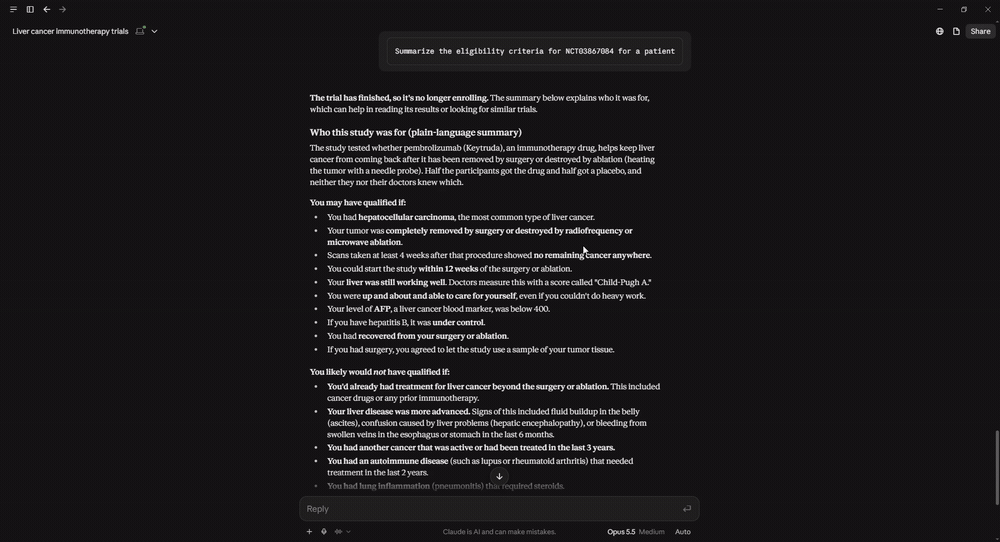

# servers/clinical/ — ClinicalTrials.gov MCP server

The first vertical shipped on the suite template. Implements the
`DataSource` Protocol over [ClinicalTrials.gov v2](https://clinicaltrials.gov/api/v2/studies)
and ships one custom LLM tool (`summarize_eligibility`).

| File | Purpose |
|---|---|
| `connector.py` | `CTGovConnector(DataSource)` — `source_id="clinical"`, `embed_fields=["brief_title","brief_summary"]`. `fetch()` paginates through CT.gov for one or more configured queries; `normalize()` maps the v2 `protocolSection` modules to a canonical `Document`; `get_raw(nct_id)` looks up one study with TTL caching (PR #4 behavior). Exports `CONNECTOR_CLASS` for the loader. |
| `ctgov.py` | The Akamai-safe `curl_cffi` client — `fetch_studies_page` (paginated) and `fetch_study` (single by NCT id). Browser-impersonated TLS handshake gets past Akamai Bot Manager; see [`docs/ENGINEERING_NOTES.md`](../../docs/ENGINEERING_NOTES.md). |
| `tools.py` | `summarize_eligibility(doc_id, reading_level)` — reads from the local `documents` table (no live API) and asks Claude to split criteria into clear inclusion / exclusion sections at the requested level. Uses `get_pool()` internally so it plugs straight into `core/server.py`'s toml-driven registration. |
| `server.toml` | Declares `source_id`, `embed_fields`, the generic tool roster (`semantic_search` / `get_details` / `find_similar`), and the custom tool list (`summarize_eligibility`). The `[connector]` table holds the connector's init kwargs (queries, page_size, max_per_query). |
| `PROJECT_QA.md` | What this server is / how it works / why, technical *and* plain-language, with interview pitches. Lifted from the pre-refactor top-level `docs/PROJECT_QA.md` so the clinical-specific Q&A lives next to the clinical code. |

## In action

Plain-language eligibility from the trial's own criteria text:



`drug_context_for_trial` — the trial's drugs against FDA approvals, labels, adverse events and recalls, as SQL with no model in the path:


## Ingest

```bash
# uses servers/clinical/server.toml's [connector] config (queries etc.)
uv run python -m core.ingest --source clinical

# advisory incremental refresh (re-runs are idempotent regardless):
uv run python -m core.ingest --source clinical --since 2026-01-01
```

`scripts/ingest_trials.py` (at the repo root) is a thin compat shim that
delegates to the command above with `--source clinical`.

## Run the MCP server

```bash
# Defaults to source_id="clinical" via MCP_SUITE_SOURCE env var.
uv run python -m core.server
# or via the compat shim that existing claude_desktop_config.json entries use:
uv run python -m clinical_trial_mcp.server
```

## Phase-A tool name changes (heads-up for upgraders)

The Phase-A refactor changed the names Claude sees:

| Pre-refactor | Post-refactor (generic) |
|---|---|
| `search_trials` | `semantic_search` |
| `find_similar_trials` | `find_similar` |
| `get_trial_details` | `get_details` |
| `summarize_eligibility` | `summarize_eligibility` *(unchanged — vertical-specific)* |

Existing `claude_desktop_config.json` entries (`python -m clinical_trial_mcp.server`)
keep working through the compat shim — only the tool *names* in the picker change.
