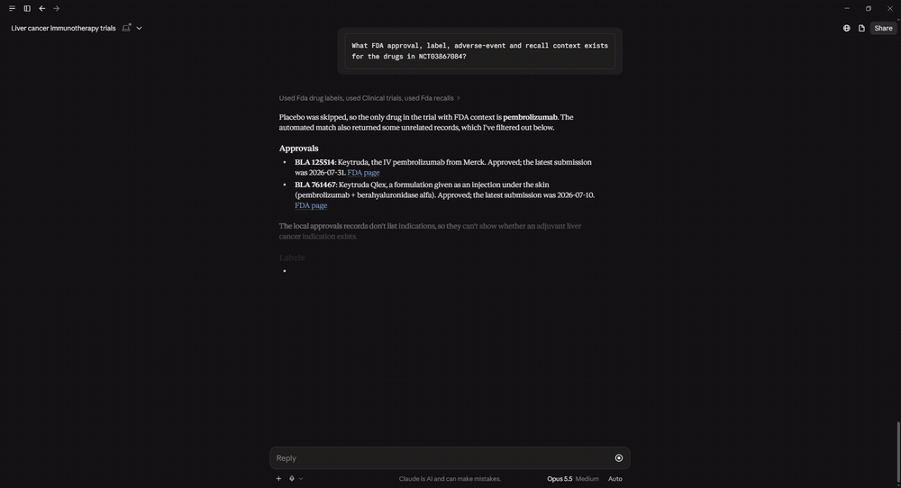

# servers/openfda_drugsfda/ — FDA Drugs@FDA approval-history MCP server

Server #4 in the suite. Completes the FDA quadrant: labels + adverse events +
recalls + **approvals**. Sources the Drugs@FDA dataset — application numbers,
sponsors, products, marketing status, and the submission/approval timeline.

| File | Purpose |
|---|---|
| `connector.py` | `OpenFDADrugsFDAConnector(OpenFDAConnectorBase)` — `source_id="openfda_drugsfda"`. `fetch()` paginates `drug/drugsfda.json` via skip/limit (inherited); `normalize()` maps the application record to a canonical `Document` (title = first product brand name; `embed_text` = brand/generic/substance/ingredient/sponsor names; url = the Drugs@FDA overview page); incremental refresh filters on the nested `submissions.submission_status_date`. `get_raw()` does an exact `search=application_number:"<id>"` lookup. |
| `server.toml` | Declares `source_id`, `embed_fields`, the generic tool list. No custom tool — the approval data is structured-lookup-first and its cross-source value is delivered via the clinical server's `drug_context_for_trial`. |

## In action

Approval history is structured-lookup-first; it reaches users through `drug_context_for_trial`:



## Ingest

```bash
uv run python -m core.ingest --source openfda_drugsfda

# Incremental refresh (filters on submission_status_date):
uv run python -m core.ingest --source openfda_drugsfda --since 2026-01-01
```

Uncomment `max_records = 50` in `server.toml` for a sanity-size backfill. An
`OPENFDA_API_KEY` in `.env` lifts the daily cap from 1k → 120k requests.

## Run the MCP server

```bash
MCP_SUITE_SOURCE=openfda_drugsfda uv run python -m core.server
```

## Tool names Claude sees

- `semantic_search` — resolve a drug name to its FDA application(s)
- `find_similar` — vector KNN from a stored application embedding
- `get_details` — full approval record (products, submissions, marketing status)

## Cross-source use

`drug_context_for_trial` (clinical server) folds this corpus in as a fourth
source: a trial's intervention drug → its FDA approval status + marketing
status alongside label warnings, FAERS signals, and recalls. The openFDA
disclaimer is appended per plan §7.
