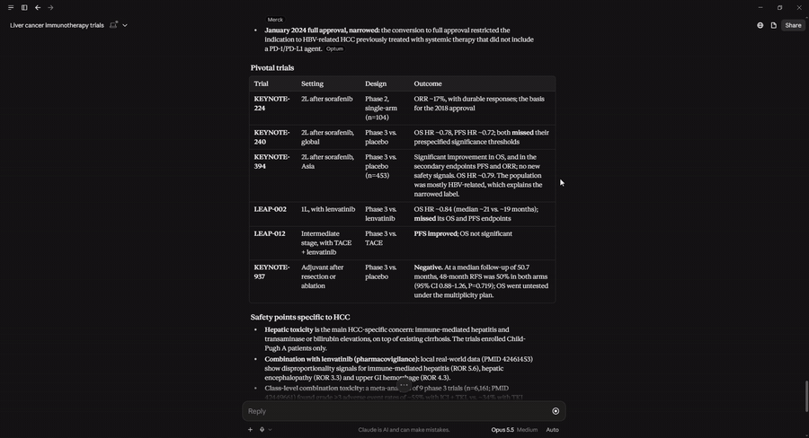
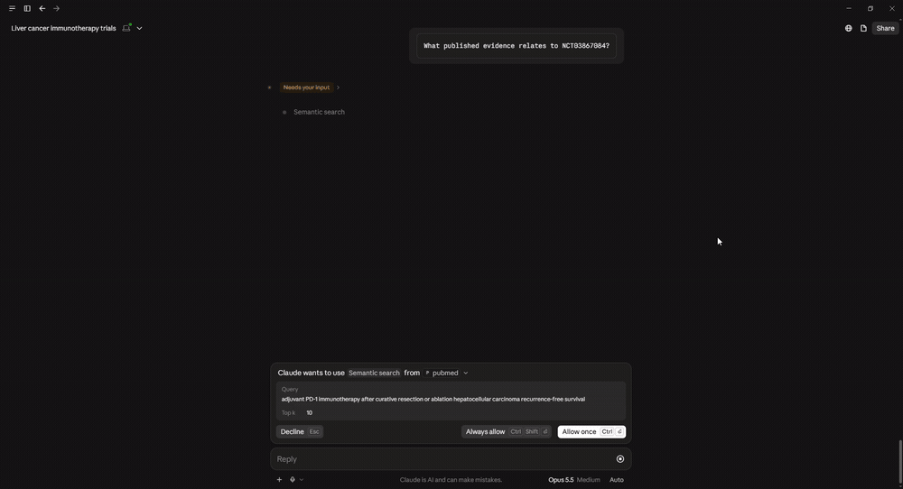

# servers/pubmed/ — PubMed biomedical literature MCP server

Server #3 in the suite. Sources peer-reviewed literature (titles, abstracts,
MeSH terms) from NCBI's PubMed via the E-utilities API. Abstracts are dense,
domain-specific text — the strongest showcase for the suite's semantic
search — and unlock the "trial/drug → published evidence" cross-server tool.

| File | Purpose |
|---|---|
| `connector.py` | `PubMedConnector` — `source_id="pubmed"`. `fetch()` pages PMIDs via `esearch.fcgi` (JSON) then batch-fetches full records via `efetch.fcgi` (XML, parsed with stdlib `ElementTree`); `normalize()` maps a record to a canonical `Document` (title + abstract + MeSH + keywords → `embed_text`; url = the canonical `pubmed.ncbi.nlm.nih.gov/<pmid>/` page); `get_raw(pmid)` efetches one record. Transient errors (transport / HTTP 429 / 5xx) retry with backoff, mirroring the openFDA base and PR #10's ctgov client. |
| `tools.py` | `summarize_evidence(topic, reading_level, top_k)` — custom LLM tool. ONE hybrid search over the local `pubmed` corpus, one Claude synthesis call, every claim cited to a retrieved PMID, baked-in not-medical-advice disclaimer. |
| `server.toml` | Declares `source_id`, `embed_fields`, the generic tool list (`semantic_search`/`get_details`/`find_similar`), and `summarize_evidence` as the custom tool. `[connector]` holds the PubMed `term` that scopes the backfill, `page_size`, and optional `max_records`. |

## In action

`summarize_evidence` — a cited synthesis whose sources include the local PubMed PMIDs:



`evidence_for_trial` (clinical server) queries this corpus from a trial id:



## Ingest

```bash
# Uses servers/pubmed/server.toml's [connector] term + page_size.
uv run python -m core.ingest --source pubmed

# Incremental refresh — filters on PubMed publication date ([pdat]):
uv run python -m core.ingest --source pubmed --since 2026-01-01
```

Edit `term` in `server.toml` to scope the corpus (PubMed query syntax, e.g.
`'osimertinib AND lung cancer'` or `'"EGFR"[MeSH]'`). Uncomment
`max_records = 50` for a sanity-size backfill.

`NCBI_API_KEY` in `.env` lifts the rate cap from 3 → 10 requests/sec
(optional). NCBI also asks every client to send `NCBI_TOOL` (defaults to
`mcp-suite`) and `NCBI_EMAIL` — neither is a secret.

## Run the MCP server

```bash
MCP_SUITE_SOURCE=pubmed uv run python -m core.server
```

Or wire it into `claude_desktop_config.json` as an `mcpServers` entry — see
the example in the repo root README.

## Tool names Claude sees

- `semantic_search` — hybrid search over the literature corpus
- `find_similar` — vector KNN from a stored article embedding
- `get_details` — live PubMed record lookup via `connector.get_raw`
- `summarize_evidence` — the cited evidence synthesizer

The clinical server's cross-server `evidence_for_trial(nct_id)` also reads
this corpus — given a trial it surfaces related published literature.

## Disclaimer (baked into every `summarize_evidence` response)

> Source: PubMed / NCBI (https://pubmed.ncbi.nlm.nih.gov). This is a summary
> of published abstracts for research and informational use only — not
> medical advice. Abstracts omit nuance from the full text; verify against
> the cited articles before relying on any finding.
